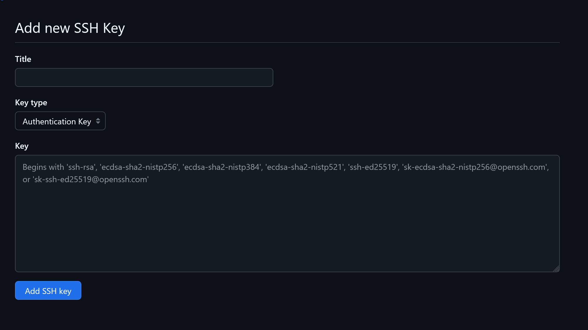
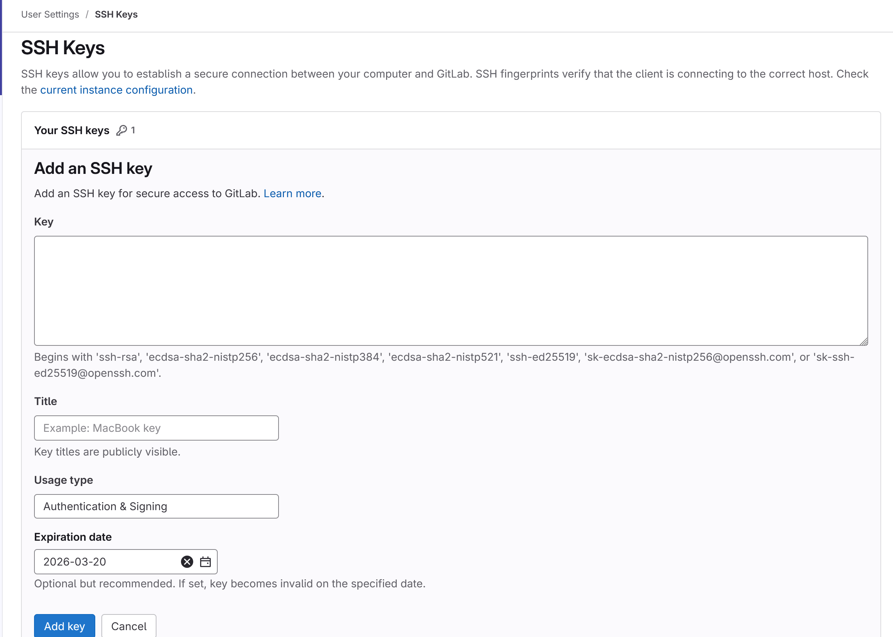

# Git

## GitHub

### Set SSH Key in Github Account
1. [Set Up SSH Key](./ssh.md#generate-ssh-key-pair), and copy you `.pub` file
2. Get into your `Github Profile Settings` > `SSH and GPG keys` > `New SSH key`.

3. Paste the content of your `.pub ` file to the `key` section, and give title whatever you want
4. Check it by running this command in your local terminal.
```sh
ssh -T git@github.com
```
5. If it success, it will show this message
```sh
Hi GungIndi! You've successfully authenticated, but GitHub does not provide shell access.
```

### Connect Local Repo to Remote Repo GitHub
```bash
# Initialize git
git init

# Add remote repo and check
git remote add origin [REMOTE_URL]
git remote -v

# Renames if needed
git branch -M main

# Pull and Rebase (if there's README file)
git pull origin main --rebase

# Set url if want to use SSH (OPTIONAL)
git remote set-url origin [REMOTE_SSH_URL]

# Usual command when wanna push
git add .
git commit -m [comment]
git push origin main
```

## Gitlab

### Set SSH Key in G Account
1. [Set Up SSH Key](./ssh.md#generate-ssh-key-pair), and copy you `.pub` file
2. Get into your `Edit Profile` > `SSH keys` > `Add new key`.

3. Paste the content of your `.pub ` file to the `key` section, and give title and expiration date whatever you want
4. Check it by running this command in your local terminal.
```sh
ssh -T git@gitlab.com
```
5. If it success, it will show this message
```sh
Welcome to GitLab, @putra.2205551079!
```

### Connect Local Repo to Remote Repo GitLab
```bash
git init --initial-branch=main
git remote add origin git@gitlab.com:gungindi/build-it.git
git add .
git commit -m "Initial commit"
git push --set-upstream origin main
```