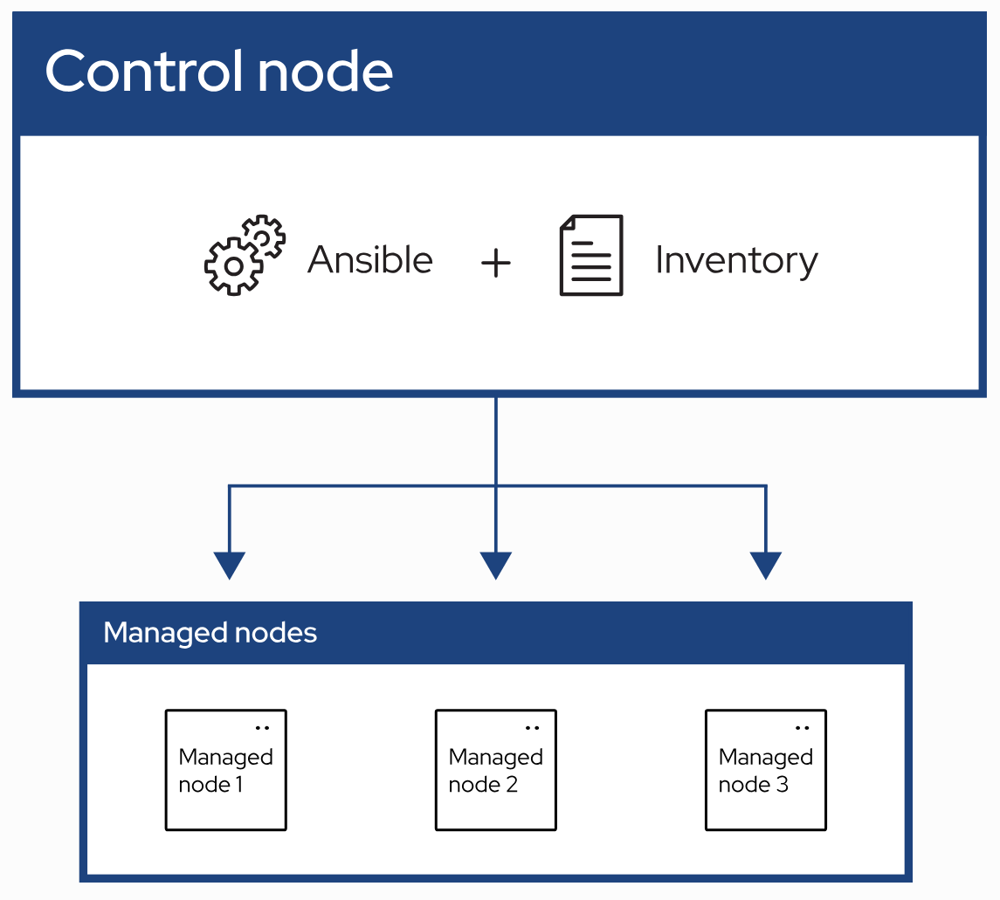

# Ansible Concepts

Ansible concist of 2 main nodes, `Control Node` and `Managed Node`

## Control Node
The machine you run ansible CLI-tools.

## Managed Node
The machine target (also refered as `hosts`) that are managed by the Ansible inside the control node. It can be servers, network appliances or any computer.

## Plugins
Pieces of code that expand Ansible’s core capabilities. Plugins can control how you connect to a managed node (connection plugins), manipulate data (filter plugins) and even control what is displayed in the console (callback plugins).

## Playbooks
They contain Plays (which are the basic unit of Ansible execution). This is both an ‘execution concept’ and how we describe the files on which ansible-playbook operates. Playbooks are written in YAML and are easy to read, write, share and understand.

## Collections
A format in which Ansible content is distributed that can contain playbooks, roles, modules, and plugins. You can install and use collections through Ansible Galaxy. Collection resources can be used independently and discretely from each other.

## AAP (Ansible Automation Platform)
A product that includes enterprise level features and integrates many tools of the Ansible ecosystem: ansible-core, awx, galaxyNG, and so on.