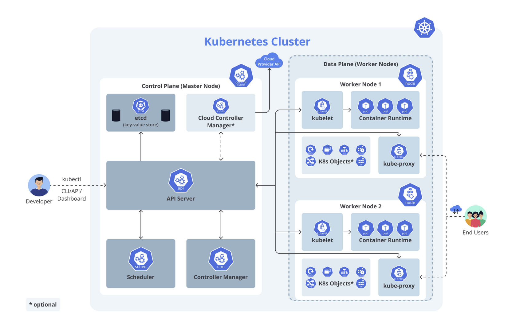

# Kubernetes Architecture

## Cluster
A **Kubernetes cluster** consists of multiple host machines (nodes), including at least one **control plane (master node)** and one or more **worker nodes** (physical or virtual machines).

## Control Plane (Master Node)
Manages scheduling and container orchestration across nodes. It includes:
- **etcd**: A distributed key-value data that maintains the **cluster state**, configuration data, and service discovery information.
- **API Server**: The core communication hub for all Kubernetes components, handling RESTful requests and acting as the interface between users and the cluster.
- **Scheduler**: Monitors newly created pods that do not have assigned nodes and determines the best node for deployment based on resource availability and constraints.
- **Controller Manager**: Runs background processes (controllers) that ensure the `observed state` align with `desired state` of the cluster, such as maintaining the correct number of pods, updating deployments, and managing node failures.

## Worker Node
Each **worker node** runs workloads assigned by the **control plane**. It includes:

- **Kubelet**: An agent running on each node that manages the node's state, starting, stopping, and maintaining containers based on instructions from the **control plane**.
- **Kubernetes Proxy (kube-proxy)**: A network proxy that manages network rules to enable communication between services inside and outside the cluster. It routes traffic and maintains network connectivity across pods.
- **Container Runtime**: Responsible for running containers on the node. Kubernetes supports multiple container runtimes such as **containerd**, **CRI-O**, and other Kubernetes **CRI (Container Runtime Interface)** implementations.

