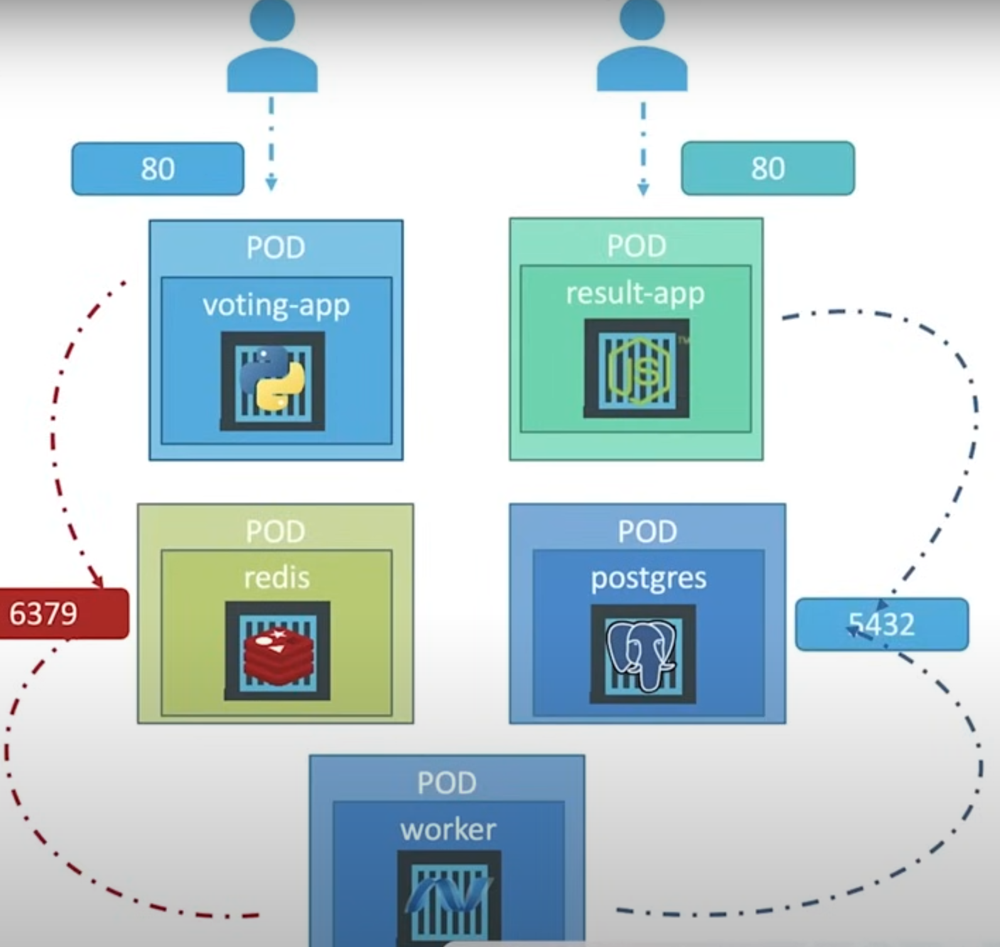

# Vote App in Kubernetes (KodeKloud)


## Manifest File

### 1. Namespace
```yaml title='namespace.yaml'
apiVersion: v1
kind: Namespace
metadata:
  name: vote
  labels:
    app: vote-app
```
### 2. Vote App
```yaml title='vote-app-deployment.yaml'
apiVersion: v1
kind: Service
metadata:
  name: vote-service
  labels:
    app: vote-app
    name: vote-service
spec:
  ports:
    - targetPort: 80
      port: 5000
      nodePort: 31000
  selector:
    name: vote-deployment-pod
    app: vote-app
  type: NodePort
---
apiVersion: apps/v1
kind: Deployment
metadata:
  name: vote-deployment
  labels:
    name: vote-deployment
    app: vote-app
spec:
  replicas: 1
  selector:
    matchLabels:
      name: vote-deployment-pod
      app: vote-app
  template:
    metadata:
      labels:
        name: vote-deployment-pod
        app: vote-app
    spec:
      containers:
      - name: vote-app
        image: kodekloud/examplevotingapp_vote:before
        ports:
         - containerPort: 80
```

### 3. Result

```yaml title='result-app-deployment.yaml'
# Service
apiVersion: v1
kind: Service
metadata:
  name: result-service
  labels:
    app: vote-app
    name: result-service
spec:
  ports:
    - targetPort: 80
      port: 5001
      nodePort: 31001
  selector:
    name: result-deployment-pod
    app: vote-app
  type: NodePort
---
# Deployment
apiVersion: apps/v1
kind: Deployment
metadata:
  name: result-deployment
  labels:
    name: result-deployment
    app: vote-app
spec:
  replicas: 1
  selector:
    matchLabels:
      name: result-deployment-pod
      app: vote-app
  template:
    metadata:
      labels:
        name: result-deployment-pod
        app: vote-app
    spec:
      containers:
      - name: result-app
        image: kodekloud/examplevotingapp_result:before
        ports:
         - containerPort: 80
```

### 4. Redis

```yaml title='redis-deployment.yaml'
#  Service
apiVersion: v1
kind: Service
metadata:
  name: redis
  labels:
    app: vote-app
    name: redis
spec:
  ports:
    - targetPort: 6379
      port: 6379
  selector:
    name: redis-deployment-pod
    app: vote-app
  type: ClusterIP
---
# Deployment
apiVersion: apps/v1
kind: Deployment
metadata:
  name: redis-deployment
  labels:
    name: redis-deployment
    app: vote-app
spec:
  replicas: 1
  selector:
    matchLabels:
      name: redis-deployment-pod
      app: vote-app
  template:
    metadata:
      labels:
        name: redis-deployment-pod
        app: vote-app
    spec:
      containers:
      - name: redis
        image: redis:alpine
        ports:
         - containerPort: 6379
        volumeMounts:
        - name: redis-data
          mountPath: /data
      volumes:
        - name: redis-data
          emptyDir: {}    # Temp data (doesn't need pv-pvc)
```

### 5. Database
```yaml title='db-deployment.yaml'
# Service
apiVersion: v1
kind: Service
metadata:
  name: db
  labels:
    app: vote-app
    name: db
spec:
  ports:
    - targetPort: 5432
      port: 5432
  selector:
    name: db-deployment-pod
    app: vote-app
  type: ClusterIP
---
# Deployment
apiVersion: apps/v1
kind: Deployment
metadata:
  name: db-deployment
  labels:
    name: db-deployment
    app: vote-app
spec:
  replicas: 1
  selector:
    matchLabels:
      name: db-deployment-pod
      app: vote-app
  template:
    metadata:
      labels:
        name: db-deployment-pod
        app: vote-app
    spec:
      containers:
      - name: db
        image: postgres:9.4
        ports:
         - containerPort: 5432
        env:
        - name: POSTGRES_HOST_AUTH_METHOD
          value: trust
        - name: POSTGRES_USER
          value: 'postgres'
        - name: POSTGRES_PASSWORD
          value: 'postgres'
        volumeMounts:
        - name: db-data
          mountPath: /var/lib/postgresql/data
      volumes:
        - name: db-data
          emptyDir: {}    # Temp data (doesn't need pv-pvc)
```

### 6. Worker
```yaml title='worker-deployment.yaml'
# Deployment
apiVersion: apps/v1
kind: Deployment
metadata:
  name: worker
  labels:
    name: worker
    app: vote-app
spec:
  replicas: 1
  selector:
    matchLabels:
      name: worker-pod
      app: vote-app
  template:
    metadata:
      labels:
        name: worker-pod
        app: vote-app
    spec:
      containers:
      - name: result-app
        image: kodekloud/examplevotingapp_worker
```