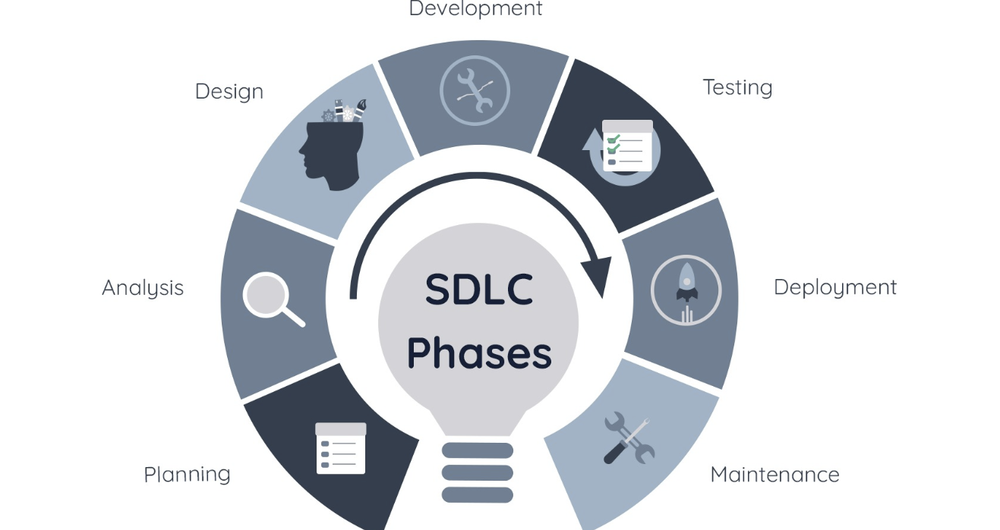

# Software Development Life Cycle (SDLC)

The **Software Development Life Cycle (SDLC)** outlines the structured process for creating software applications. It consists of the following stages:

1. **Planning** – Defining the project scope and objectives.
2. **Analysis** – Gathering and analyzing requirements.
3. **Design** – Creating system and software architecture.
4. **Development** – Writing and implementing the code.
5. **Testing** – Ensuring the software functions correctly.
6. **Deployment** – Releasing the software for use.
7. **Maintenance** – Updating and improving the software over time.

## Documentation in SDLC

### 1. User Requirements Specification (URS)
This document details user needs before software development begins. It serves as a communication tool between stakeholders and developers, reducing misunderstandings and ensuring clarity. The URS should be written in simple language and include tables or diagrams.

#### **Requirement Gathering Methods**
- **Interviews** – Asking questions and collecting feedback from stakeholders.
- **User Stories** – Understanding the application from a user’s perspective to identify strengths and weaknesses.
- **Straw Man Documents** – Presenting ideas for an application without writing actual code (e.g., flowcharts, storyboards, HTML mock-ups).
- **Prototyping** – Developing a minimal version of the application to collect stakeholder feedback.

### 2. Technical Specification Document
This document provides detailed information on the functionality, requirements, and constraints of the application.

#### **Principles of Technical Specification**
- **Clear** – Easily understood by all stakeholders.
- **Unambiguous** – Avoids vague descriptions.
- **Complete** – Covers all necessary details.
- **Consistent** – Maintains coherence throughout the document.

#### **Stakeholder Perspectives**
- **Developers** – Implement application specifications.
- **Clients/Users** – Utilize the application.
- **Legal Compliance** – Ensure the application meets acceptance criteria and regulatory standards.

#### **Contingency Plan**
A backup plan (Plan B) is included to address potential failures or issues during the development or deployment process.

### 3. Software Requirements Specification (SRS)
#### **Definition**
The Software Requirements Specification (SRS) outlines the functional and non-functional requirements of an application. It is crucial for developers, testers, UI/UX designers, and investors.

#### **Benefits**
- **UI/UX Designers** – Use the SRS to create user-friendly designs.
- **Testers** – Develop test cases based on the documented requirements.
- **Users** – Understand the purpose and functionality of the software.
- **Investors** – Evaluate the application’s potential and feasibility.

#### **Key Elements of an SRS**
- **Application Objectives** – The purpose of the software.
- **General Description** – Overview of the system.
- **Functional and Non-Functional Requirements** – Features and performance expectations.
- **Performance Requirements** – Expected behavior in production.
- **User Interface (UI) Design** – Guidelines for visual and interactive elements.
- **System Constraints** – Limitations and dependencies.

#### **Types of Requirements**
- **Functional Requirements** – Specific features and functionalities.
- **Non-Functional Requirements** – Supporting requirements such as performance, security, reliability, and usability.

#### **Structure of an SRS**
1. **Introduction** – Summary of the software’s function and purpose.
2. **Glossary** – Definitions of technical terms.
3. **User Requirements** – Description of services provided to users, often illustrated with diagrams.
4. **System Architecture** – High-level overview of the application’s architecture.
5. **System Requirements** – Detailed functional and non-functional requirements.
6. **System Models** – Object models, data flow models, or semantic data models.
7. **Development Plan** – Future development roadmap.
8. **Appendix** – Additional supporting details.

By following these structured documents, software development teams can ensure clear communication, efficient development, and high-quality applications.

